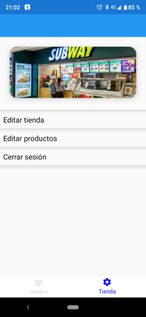
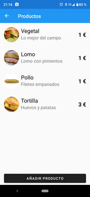
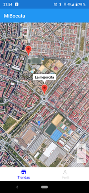

# Mibocata - Aplicacción de ejemplo

### Este repositorio contiene una serie de proyectos que representan todo el sofware de una empresa ficticia tipo JustEat, Glovo u otras.
### Contiene el backend, aplicación de gestion de pedidos y store enfocada al empresario y aplicación enfocada a los clientes que realizarán pedidos a las tiendas.

## Tecnologías
* Ambas apps (Businnes y Client) estan realizadas en  [.NET 6 MAUI](https://docs.microsoft.com/es-es/dotnet/maui/what-is-maui)
* Bussines implementa WinUI , IOS y Android
* Client implementa IOS y Android
* El backend usa Asp .net6 Api con base de datos MySql
* El acceso a datos se realiza con Entity Framework Core y los modelos son compartidos en todos los proyectos
------

### Screenshots

#### Businnes

#### Client

------

### TODO
- [ ] Finalizar port a .net maui

# Contributing
Este proyecto acepta cualquier tipo de aporte de todos los usuarios. Solo tienes que hacer tu Pull Request.

**Happy coding! :sparkles: :camel: :boom:**

