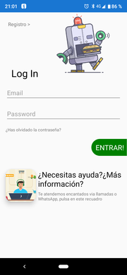
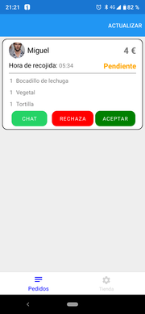
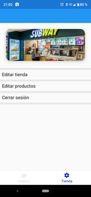
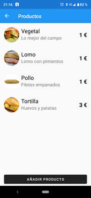
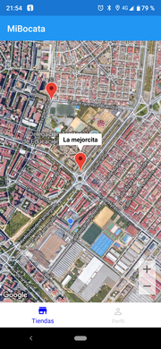
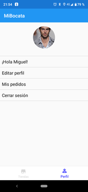
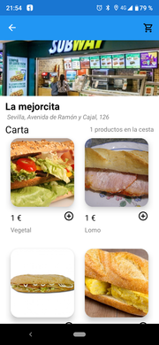
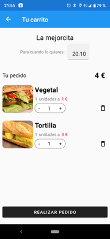

# Mibocata - .NET MAUI Sample Application

### This repository contains a series of projects that represent all the software of a fictitious company like JustEat, Glovo or others.
### Contains the backend, order and store management application focused on the entrepreneur and application focused on the customers who will place orders to the stores.

## Technologies
* Both apps (Businnes and Client) are made with [.NET 6 MAUI](https://docs.microsoft.com/es-es/dotnet/maui/what-is-maui)
* Bussines implements WinUI, IOS and Android.
* Client implements IOS and Android
* Backend uses Asp .net6 Api with MySql database
* Data access is done with Entity Framework Core and models are shared in all projects.
------

### Screenshots

#### Businnes

#### Client

------

### TODO
- [ ] End port to .net maui

# Contributing
This project accepts any kind of contribution from all users. Just make your Pull Request.

**Happy coding! :sparkles: :camel: :boom:**

